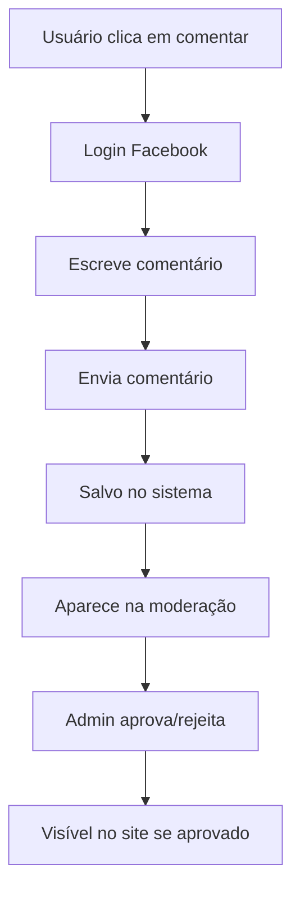

# 💬 Sistema de Comentários com Facebook Login

## 📋 Visão Geral

O sistema de comentários foi implementado para permitir que visitantes comentem em **Notícias** e **Galerias** usando autenticação do Facebook/Meta. 

### ✨ Funcionalidades

- **🔐 Login obrigatório** via Facebook/Meta
- **📝 Comentários** em notícias individuais
- **🖼️ Comentários** em galerias (álbuns)
- **📸 Comentários** em fotos individuais
- **💬 Respostas** aos comentários (sistema de threads)
- **👥 Conversas aninhadas** entre usuários
- **❤️ Sistema de curtidas** nos comentários e respostas
- **✏️ Editar/excluir** próprios comentários
- **🔧 Moderação** completa na área administrativa
- **📊 Estatísticas** de comentários no painel admin

## 🗣️ Sistema de Respostas

### Como Funciona:

1. **📱 Interface intuitiva** - Botão "Responder" visível em cada comentário
2. **🎯 Contexto claro** - Mostra para quem está respondendo
3. **🧵 Threading** - Respostas aparecem aninhadas e conectadas
4. **📊 Contador** - Exibe quantas respostas cada comentário tem
5. **🎨 Design responsivo** - Interface adaptada para mobile e desktop

### Funcionalidades de Resposta:

- **↩️ Responder** a qualquer comentário principal
- **🚫 Não permite** respostas de respostas (evita threading excessivo)
- **👁️ Visualização clara** da hierarquia de conversas
- **⚡ Feedback instantâneo** ao adicionar respostas
- **🛡️ Moderação** individual de cada resposta

## 🏗️ Arquitetura

### Componentes Principais:

1. **`CommentsContext.tsx`** - Context para gerenciamento de estado
2. **`CommentsSection.tsx`** - Componente principal de comentários
3. **`admin/views/CommentsView.tsx`** - Interface de moderação

### Integração:

- **NewsPage.tsx** - Comentários em notícias
- **GalleryPage.tsx** - Comentários em galerias e fotos
- **AppProviders.tsx** - Provider global

## ⚙️ Configuração do Facebook

### 1. Criar App no Facebook Developers

1. Acesse [Facebook Developers](https://developers.facebook.com/)
2. Crie uma nova aplicação
3. Adicione o produto "Facebook Login"
4. Configure os domínios válidos

### 2. Configurar App ID

Edite o arquivo `/components/CommentsContext.tsx`:

```typescript
// Substitua pelo seu App ID do Facebook
const FACEBOOK_APP_ID = '1234567890123456';
```

### 3. Configurar Domínios

No painel do Facebook:
- **Domínios válidos**: `localhost`, `seu-dominio.com`
- **URLs de redirecionamento**: `http://localhost:3000`, `https://seu-dominio.com`

## 🎯 Como Usar

### Para Visitantes:

1. **Navegar** para uma notícia ou galeria
2. **Clicar** em "Entrar com Facebook"
3. **Autorizar** o acesso
4. **Escrever** e enviar comentários
5. **Curtir** e **responder** outros comentários

### Para Administradores:

1. **Acessar** a aba "Comentários" no painel admin
2. **Moderar** comentários (aprovar/rejeitar)
3. **Visualizar** estatísticas
4. **Filtrar** por tipo de conteúdo e status

## 📱 Tipos de Comentários

### 📰 Notícias (`postType: "news"`)
- Aparecem abaixo do conteúdo da notícia
- Identificados pelo ID da notícia

### 🖼️ Galerias (`postType: "gallery"`)
- Aparecem no modal de visualização do álbum
- Comentários sobre a galeria como um todo

### 📸 Fotos (`postType: "photo"`)
- Aparecem no modal de visualização da foto individual
- Comentários específicos sobre uma foto

## 🔐 Sistema de Permissões

### Permissões para Comentários:

```typescript
// Visualizar comentários
"comments.view"

// Moderar comentários (aprovar/rejeitar)
"comments.moderate"
```

### Configuração no Sistema:

Os comentários são uma nova funcionalidade que requer as permissões acima para serem gerenciados no painel administrativo.

## 🎨 Interface

### Componente CommentsSection:

```tsx
<CommentsSection 
  postId="123"                    // ID do post/galeria/foto
  postType="news"                 // "news" | "gallery" | "photo"
  postTitle="Título do Post"      // Título para exibição
  showTitle={true}                // Mostrar título da seção
  className="custom-class"        // Classes CSS customizadas
/>
```

## 📊 Moderação

### Estados dos Comentários:

- **✅ Aprovado** (`isApproved: true`) - Visível no site
- **⏳ Pendente** (`isApproved: undefined`) - Aguardando moderação
- **❌ Rejeitado** (`isApproved: false`) - Não visível

### Ações Disponíveis:

- **Aprovar** comentários pendentes
- **Rejeitar** comentários inapropriados
- **Visualizar** detalhes do autor
- **Filtrar** por status e tipo

## 🔄 Fluxo de Dados



## 🛠️ Customização

### Estilos:

Os comentários usam os componentes do shadcn/ui e podem ser customizados via Tailwind CSS.

### Validação:

- **Conteúdo obrigatório** para comentários
- **Login obrigatório** via Facebook
- **Moderação** opcional (pode ser automática)

## 🚀 Próximos Passos

### Melhorias Futuras:

1. **📧 Notificações** por email para novos comentários
2. **🔔 Notificações** push para administradores
3. **📈 Analytics** avançados de engajamento
4. **🎯 Filtros** de conteúdo automatizados
5. **📱 App móvel** dedicado para moderação

## 🆘 Solução de Problemas

### Facebook SDK não carrega:
- Verifique se o App ID está correto
- Confirme se o domínio está autorizado
- Verifique a conexão com a internet

### Comentários não aparecem:
- Verifique se estão aprovados na moderação
- Confirme se o usuário tem permissões de visualização
- Verifique os filtros aplicados

### Erro de permissões:
- Confirme se o usuário tem as permissões corretas
- Verifique se é Super Admin ou tem permissões específicas
- Revalide as configurações de RBAC

## 📞 Suporte

Para dúvidas ou problemas:
1. Verifique este documento primeiro
2. Consulte os logs do navegador (F12)
3. Teste em modo de navegação privada
4. Verifique as configurações do Facebook App

---

**🎉 Sistema implementado com sucesso!** Os visitantes agora podem interagir através de comentários nas notícias e galerias, com moderação completa para os administradores.